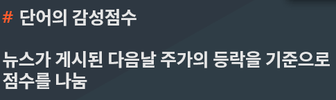
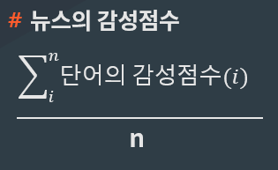
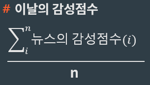
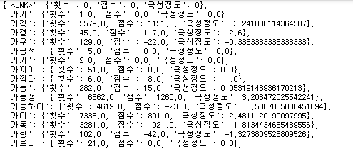

# Stock price prediction by news data sensitivity analysis
> 뉴스 데이터 감성분석을 통한 주가 예측

## Introduction
신종 코로나바이러스 감염증(코로나19) 폭락장을 계기로 증시 세대교체가 이뤄지고 있다. 모험적인 투자성향을 갖고 있는 밀레니얼 세대(2030세대)가 시장의 새로운 주력군으로 부상중이다.

(통계 자료 : https://www.hankyung.com/finance/article/2020091346211)

"저축으론 집 못 사…자산 늘리려면 주식밖에 없다"

이런 생각으로 주식을 시작한 20~30대가 많다. 이러한 사람들에게 뉴스 텍스트 분석을 통하여 주식투자의 방향성을 가질수 있게 해주는 것이 본 프로젝트의 목표입니다.


##  Directory structure
``` 
  |-TextData           
  |  |-
  |  
  |  
  |
  |-Dictionary    
  |  |-
  |  
  |
  |-TextAnalyze   
  |  |-
  |
  |-Crawler                     
  |  |-BigKinds_crawler.py                            
  |                          
  |
  |-README.md                                #이 문서

```
## Getting started
###  Dependency Build Instructions
```
pip install Selenium
pip install pandas
pip install numpy
pip insatll tenserflow
pip insatll keras
pip install datetime
pip install Konlpy
pip install pickle
pip install nltk
pip insatll windowsound

```

### Tokenize
 뉴스데이터 토큰화를 위한 다양한 토크나이즈를 비교
 Okt 가 정형화 된 뉴스데이터에 사용하기에 가장 적합하여 Okt로 토큰화 진행

### Dictionary
 주가의 증감에 따라 감성점수를 부여하고 그것을 아래에 공식에 따라 점수를 계산하여 사전화를 진행
 
#### Emotional score formula
 단어의 감성점수


 
 뉴스의 감성점수


 
 이날의 감성점수



#### Dictionary Example


### Modeling
1.  TF-IDF 
- TF-IDF 점수를 기반하여 데이터 순도를 높임
2. N-gram
- 토큰화된 데이터를 기반으로 Bi-gram,Tri-gram을 만든 후 모델링 진행
3. LSTM
- LSTM 모델 선정 이유는 감성점수가 주가 데이터와 같이 순서가 있는 시계열(Time-series) 데이터이기 때문입니다.
 

## Contact & Feedback
~~~
박근수 
- E-mail : papa2618@gmail.com
윤성연
- E-mail : datascience123@naver.com
채윤길  
- E-mail : mw6218@naver.com
~~~

